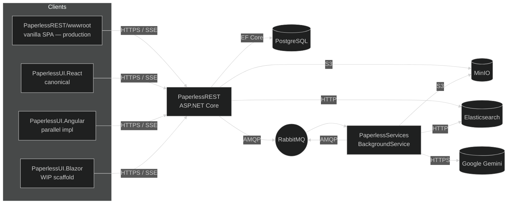

<div align="center">

# Paperless

**Document management with OCR, AI summarization, and full-text search.**
.NET 10 backend · React + Angular frontends (Blazor scaffold WIP) · NUKE + xUnit v3 + Testcontainers.

<a href="https://github.com/ANcpLua/Paperless/actions/workflows/ci.yml">
  
</a>
<a href="https://codecov.io/gh/ANcpLua/Paperless">
  
</a>

</div>

---

## Layout

```
Paperless.slnx                          # MSBuild slnx (modern format)
├── PaperlessREST/                      # ASP.NET Core API (REST + SSE)
├── PaperlessServices/                  # Background worker (OCR + GenAI)
├── PaperlessREST.Tests/                # xUnit v3 (unit + integration via Testcontainers)
├── PaperlessServices.Tests/            # xUnit v3 (unit + integration)
├── PaperlessREST/wwwroot/              # Vanilla Bootstrap SPA — production demo UI served by nginx
├── PaperlessUI.React/                  # Frontend variant — Vite 8 + React 19 + TypeScript (canonical)
│   └── PaperlessUI.React.esproj
├── PaperlessUI.Angular/                # Frontend variant — Angular 21 + pnpm (parallel impl)
│   └── PaperlessUI.Angular.esproj
├── PaperlessUI.Blazor/                 # Frontend variant — Blazor Web App scaffold (WIP, not in slnx, not built by CI)
│   └── PaperlessUI.Blazor.csproj
├── Pipeline/                           # NUKE build (`./build.sh <Target>`)
├── docker/                             # nginx config (single file: docker/nginx.conf)
├── sample-data/                        # XML batch + PDF fixtures
└── compose.yaml                        # Local stack (postgres, minio, rabbitmq, elastic)
```

The production demo today is the vanilla SPA at `PaperlessREST/wwwroot/` (mounted by nginx in `compose.yaml`). React and Angular are parallel SDK-stack implementations consuming the same `/api/*` surface; Blazor is on-disk but not currently building.

## Quick start

```bash
docker compose up -d                    # postgres, rabbitmq, minio, elasticsearch
./build.sh Compile                      # NUKE: builds the slnx end-to-end
./build.sh UnitTests                    # MTP v2 + xUnit v3
./build.sh IntegrationTests             # Testcontainers
./build.sh Coverage                     # Cobertura via MTP CodeCoverage
./build.sh ReportCoverage --coverage-min-line 0 --coverage-min-branch 0 --coverage-format markdown --coverage-exclude-generated-param true
```

### Run individual UIs

```bash
# React (Vite) — canonical
cd PaperlessUI.React   && pnpm install --frozen-lockfile && pnpm dev

# Angular — parallel implementation
cd PaperlessUI.Angular && pnpm install --frozen-lockfile && pnpm start

# Blazor scaffold (WIP, not currently in Paperless.slnx)
# dotnet run --project PaperlessUI.Blazor
```

## Architecture



## CI + Coverage

`Build & Test` (gate): backend unit + integration + coverage gate + Codecov upload.
Two non-gating jobs build the Angular and React apps via `pnpm`.

Coverage uploads to https://codecov.io/gh/ANcpLua/Paperless via tokenless OIDC.
`codecov.yml` ignores host entry points, EF migrations, and the build pipeline so the score reflects production surface only.

## Rating-Matrix mapping

The course rubric in [`docs/99_Reference/Rating-Matrix/`](docs/99_Reference/Rating-Matrix) maps to:

| Category | Where it lives |
|---|---|
| **Use Cases / REST API** | `PaperlessREST/Features/DocumentManagement/Presentation/Endpoints/DocumentEndpoints.cs` |
| **Web Frontend** | `PaperlessREST/wwwroot/` (vanilla SPA, production demo) + `PaperlessUI.React/` (canonical) + `PaperlessUI.Angular/` (parallel impl). `PaperlessUI.Blazor/` is a WIP scaffold, currently out of build. |
| **Queues** | `SWEN3.Paperless.RabbitMq` package consumed by REST + Services |
| **Logging** | `Microsoft.Extensions.Logging` everywhere; `FakeLogger` in tests |
| **Validation** | Mapster + DataAnnotations + FluentValidation at the boundary |
| **Stability** | `Microsoft.Extensions.Http.Resilience` (Polly v8) for Gemini |
| **Unit Tests** | `*.Tests/Unit/**` with `MockBehavior.Strict` repositories |
| **Integration Tests** | `*.Tests/Integration/**` on Testcontainers |
| **Clean-Code** | SOLID, ErrorOr result types, vertical-slice Feature folders |
| **Packaging** | `compose.yaml` + per-project `Dockerfile` |
| **Loose Coupling** | every cross-layer call is interface-mediated |
| **Mapper** | Mapster (`MapsterExtensions.Generator`) |
| **DI** | `IServiceCollection` extension methods per feature |
| **DAL** | EF Core 10 + repository pattern (`IDocumentRepository`) |
| **BL** | `DocumentService`, `OcrProcessor`, GenAI worker |
| **GitFlow / Issues / CI / Docs** | this README + `.github/workflows/ci.yml` + branch-protected `main` |

## Stack

| Backend | Frontends | Infra |
|---|---|---|
| .NET 10, ASP.NET Core, EF Core 10.0.x, Mapster, ErrorOr, Hangfire 1.8.23, Polly | React 19.2 + Vite 8 + TypeScript 6 (canonical), Angular 21 + pnpm 10 (parallel), Blazor Web App scaffold (WIP) | PostgreSQL 17, RabbitMQ 4.3, MinIO (date-pinned), Elasticsearch 9.1, nginx |
| xUnit v3.2.x, MTP v2, Testcontainers, AwesomeAssertions, Moq | – | OrbStack / Docker Compose |

(Exact pin values live in `Version.props` and `Directory.Packages.props` — the table is commentary.)
